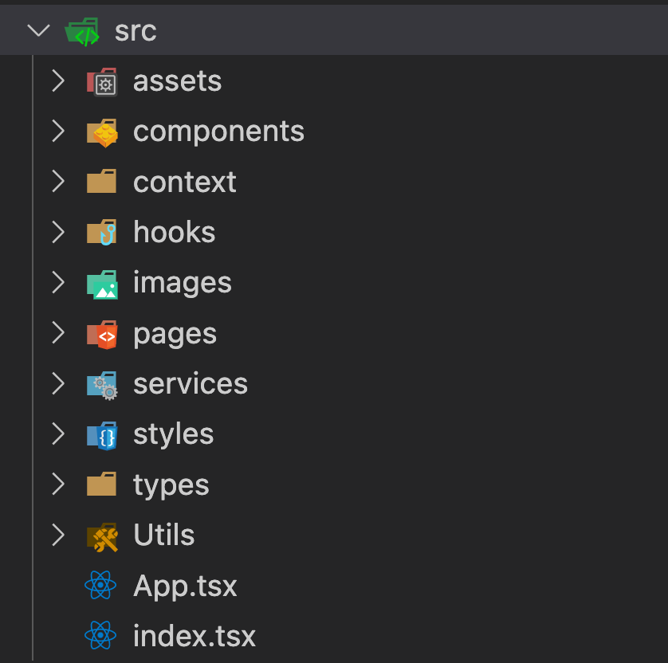
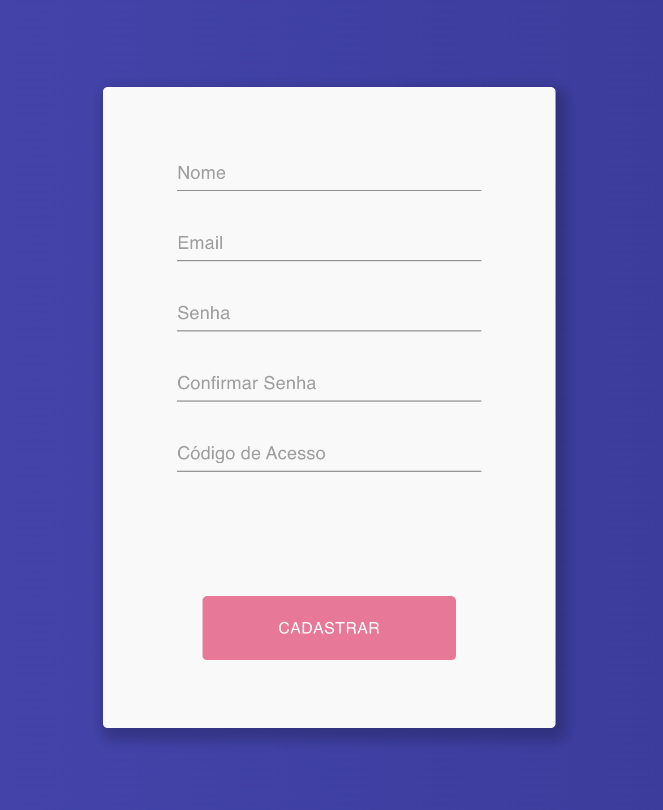

# Raro Class - English

Raro Class is a web application built with React that provides online classes and educational resources to students. This repository contains the frontend codebase for the application.

## Features

The application includes the following features:

- User authentication and authorization
- Course listing and filtering
- Video lessons playback
- Discussion forum for each course
- Quizzes with multiple-choice questions
- Leaderboards to show top performers

## Installation

To run the application locally, follow these steps:

1. Clone the repository:

   ```
   git clone https://github.com/eduardo-borges-goncalves/Raro-Class.git
   ```

2. Install the dependencies:

   ```
   npm install
   ```

3. Start the development server:

   ```
   npm start
   ```

The application should now be running on [http://localhost:3000](http://localhost:3000).

## Technologies Used

The following technologies were used to build the application:

- React
- React Router
- Redux
- Axios
- Bootstrap
- Font Awesome

## Contributing

Contributions are welcome! If you find any bugs or have suggestions for new features, please open an issue or submit a pull request.

## License

This project is licensed under the [MIT License](LICENSE).

# Raro Class - Português :mortar_board:

## Introdução  :pencil:
 <br>

 Este projeto foi criado visando permitir aos alunos dos cursos da Raro Academy poderem assistir as gravações das aulas, além de disponibilizar para toda comunidade aulões públicos. 
 <br>

## Vamos Começar   :white_check_mark:
<br>

Para começar, **baixe o projeto para sua máquina utilizando o git**. Caso não tenha o git instalado, baixe [aqui](https://git-scm.com/downloads) :link:

``` 
git clone https://github.com/rarolabs/raro-academy-react-grupo-4.git 
```

Por conseguinte, caso ainda não tenha o node instalado, baixe primeiro o programa [aqui](https://nodejs.org/pt-br/download/) :link:. Após a instalação, abra a pasta em que você baixou o projeto no terminal e **baixe as dependências** com o seguinte comando: 

```
npm install
```

Se tudo correu bem, é hora de rodar o projeto, digite no terminal o seguinte comando:

```
npm start
```

Novamente, se tudo deu certo, você já pode começar a se divertir! :tada: 

<br>

## Estrutura 
 <br>

 <ul>:file_folder: Public</ul>


 <br>

 <ul>:file_folder: Src </ul>
 


 <br>


 <ul>:wrench: Configurações </ul>
 


 <br>

 <ul>:blue_book: Documentação </ul>

 - README.md 
 
 <br>

## Arquitetura e Bibliotecas  :triangular_ruler:
<br>

A priori, esse sistema foi construído com [**React**](https://pt-br.reactjs.org/), e, por isso, tem uma estrutura flexível, sendo implementada de acordo com as boas práticas vigentes e à medida que foi sendo percebida a necessidade de determinadas pastas.
Por conseguinte, ele usa algumas bibliotecas para facilitar seu desenvolvimento, entre elas: _react router, styled components, js-cookies, axios, zustand, além de claro, react-dom._ 
Assim, 

- O **roteamento** é feito pelo [React-Router](https://reactrouter.com/docs/en/v6), usando a tag _BrowserRouter_ na raíz do projeto, o que permite a divisão em rotas com as tags _Routes_, _Route_ e _Links_.

- Os **estados globais** são configurados na pasta Context, usando [Context](https://pt-br.reactjs.org/docs/context.html).

- A **conexão com a API** é realizada por meio do [Axios](https://axios-http.com/ptbr/docs/intro), que é configurado na pasta _services_, em api-client.ts. Essa configuração permite deixar o código mais legível. 

- O estilo é feito com as bibliotecas [Styled Components](https://styled-components.com/) e [Material UI](https://mui.com/), que permite a edição de CSS em arquivos JS/TS, facilitando a reutilização de componentes.

- A linguagem usada é o [TypeScript](https://www.typescriptlang.org/docs/).

- A autenticação é realizada com **Cookies**, por meio da lib _[Js-Cookies](https://www.npmjs.com/package/js-cookie)_. 

<br>

## Public e Src  :open_file_folder:
<br>

A pasta _public_ contém os assets necessários ao sistema, ou seja, imagens, logos e coisas do tipo, além de possuir o único arquivo html em que será renderizada toda a aplicação. Foco especial na div `id="root"` , que é capturada pelo _index.tsx_, `  document.getElementById('root')`, sendo esta a raíz do nosso sistema. 

Já a pasta _src_ contém toda a parte lógica do projeto, além da estilização. 

<br>

## Rotas  :triangular_flag_on_post: 
<br>

As **Rotas** são configuradas no _app.tsx_ e no _index.tsx_, passando as páginas por meio de suas propriedades ```element```. 

<br>

##  Estilo  :art:
<br>

O **Estilo** é configurado globalmente na pasta _Styles_ e individualmente em cada pasta dos componentes.
Utilizamos também a lib **Material UI**, nos inputs e icons do projeto.

<br>

## Componentes e Pages 
<br>

A aplicação é divida em **Componentes**, para facilitar sua legibilidade e manutenção. As páginas estão intuitivamente na pasta _Pages_, ao passo que seus componentes menores e reaproveitáveis estão contidos na pasta _Components_. 

<br>

##  Hooks  :construction:
<br>

Nesta pasta, temos hooks próprios da aplicação, como o _useLogin_, que é aproveitado em mais de uma página.

<br>

## Types
<br>

A pasta **Types** contém os tipos criados e reutilizados na aplicação. 

<br>

## Outros
<br>

O arquivo _.gitignore_ é voltado às configurações do [Git](https://git-scm.com/), sendo bastante útil para conseguir ignorar alguns arquivos como o node_modules na hora de enviar o projeto para [GitHub](https://github.com/) :octocat: , por exemplo.

Os arquivos _index.d.ts_ e _tsconfig.json_ servem guardam as configurações do TypesScript. O arquivo _index.d.ts_ tem a finalidade de declarar tipos para aplicações ou bibliotecas originalmente feitas em JavaScript.

Os arquivos _package_ são configurações do projeto.

<br>

##  Páginas  :page_with_curl:
<br>

A aplicação conta com cinco páginas, a saber: 

1. **Login**
2. **Register**
3. **Recovery Password**
4. **Home **
5. **Video**

<br>

### :closed_lock_with_key:  Login
<br>

Utiliza o hook _useLogin_ para autenticar o usuário na API, guardar o token e o id do usuário nos cookies por meio da função _handleAuthUser_. Esta, segue o padrão de nomenclatura da comunidade react, em que as funções chamadas por um usuário iniciam-se pelo termo handle. Além disso, recebe o evento criado pelo clique no botão de entrar, e passa à API os valores guardados nos estados de email e senha.
 
 

<br>

### :lock:  Register
<br>

O **RegisterPassword**, ou SignUp possui uma função para validação dos dados do usuário, exigindo que o nome e a senha possuam no mínimo 3 e 6 caracteres respectivamente. Por conseguinte, confirma se as duas senhas são iguais e chama a função responsável por cadastrar o usuário, registerUser(). Essa passa nome, email, senha e código de acesso para a API, além de alterar o texto do botão para "cadastrando". Em caso de erro, é alterado o estado de erro e mostrado na tela para o usuário.  



<br>

### :key:  Recovery Password
<br>

Esta página serve para o usuário criar uma nova senha, caso tenha esquecido a sua.
É realizado envio de um código para o email cadastrado pelo usuário, para que a partir da validação deste código, o usuário possa redefinir sua senha.


<br>

### :house:  Home
<br>

Esta é a página principal do site, que exibe a lista de vídeos públicos (caso usuário não esteja logado), e a lista completa de todos os vídeos, organizados em sessões, contendo seu tempo de duração e a opção de favoritar o vídeo, facilitando a navegação do usuário.


<br>

<br>

### :vhs:  Video
<br>

A página de detalhe do vídeo é o local onde o usuário vai conseguir assistir os vídeos, receber sugestões de vídeos para assistir em sequência, ler os comentários dos outros usuários, reagir aos mesmos e deixar seus próprios comentários.
Vale lembrar que essas funcionalidades somente são exibidas se o usuário estiver logado. Caso contrário, só poderá assistir aos vídeos públicos.


<br>

<br>


<br>


## :busts_in_silhouette: Colaboradores
<br>

-Bernardo Andrade

-Eduardo Borges

-Jonathan Marvin Chu

-Luciana Moreira

-Marlon Lamartine

<br>


## :copyright: À espera do sextou (grupo 4)
